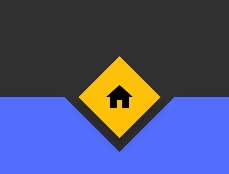
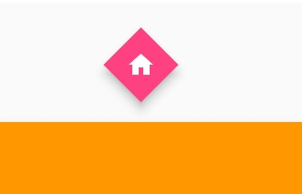
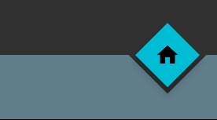

# diamond_fab

A simple package for adding a Diamond Floating Action Button or FAB to a flutter application.  This FAB also allows for a notch to be made inside of the Bottom Application Bar or Bottom Navigation Bar based on the positioning. 

FAB code is based on the original Floating Action Button Source code and the Material Design specification. 

## Getting Started

Add this to your package's pubspec.yaml file:


```
dependencies:
  diamond_fab: "^0.1.0"
```

## Screenshots




